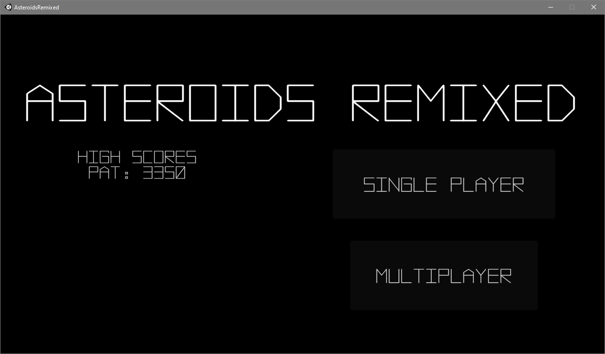
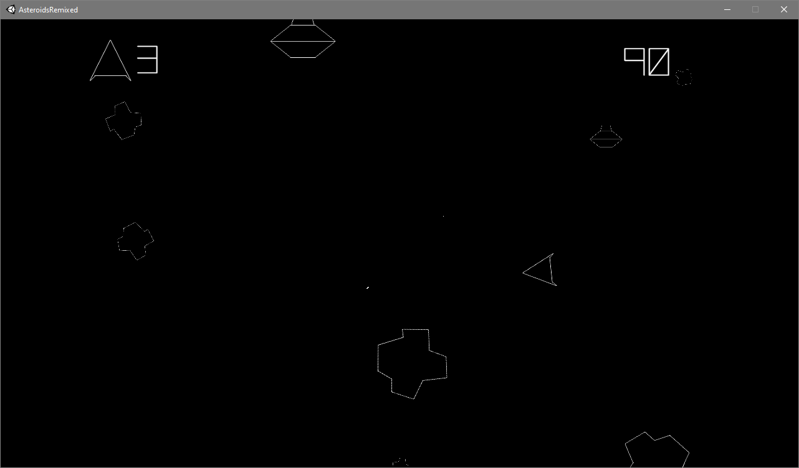
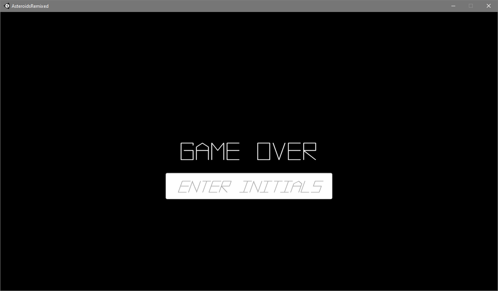

# Asteroids

This repo contains the project developed by [Jesus Fuentes](
https://github.com/jefuentesnava), [Ben Lee](https://github.com/benjamin0821),
[Patrick Silvestre](https://github.com/pjsilvestre), and [Jeffrey Wu](
https://github.com/JesWu) for CMPE 165 at San Jose State University during the
Spring 2020 semester.

## Latest Release (Windows)

[1.0.1](https://github.com/pjsilvestre/Asteroids/releases/tag/v1.0.1)

To play:

* Download `asteroids-build.zip`
* Unzip `asteroids-build.zip`
* Run `AsteroidsRemixed.exe`

## Controls

* Movement: WASD
* Shooting: Space Bar
* Teleport (once per game): Left Shift

## Demo Video

## Screenshots

### Main Menu

### Gameplay

### Game Over

